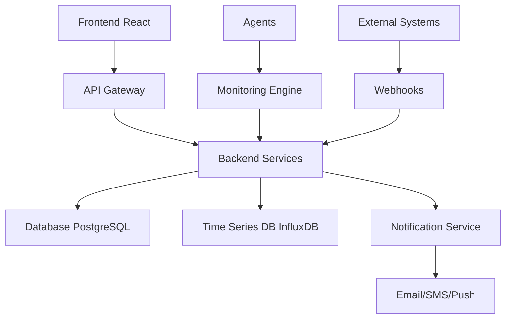

# InfraWatch

  
  <h1 style="font-size: 2.5em; color: #1a3c5e; font-family: 'Arial', sans-serif;">InfraWatch</h1>
  
Plataforma de Monitoramento de Infraestrutura Corporativa

  
Visibilidade total, controle absoluto da sua infraestrutura tecnológica

---

## Visão Geral

O **InfraWatch** é uma solução avançada e intuitiva para monitoramento de infraestruturas corporativas, projetada para centralizar a gestão de redes, servidores, aplicações e endpoints. Com foco em tempo real, garante alta disponibilidade e confiabilidade para serviços críticos, oferecendo uma interface moderna e insights acionáveis.

!!! success "Objetivo Principal"
    Proporcionar uma plataforma unificada que capacita organizações a monitorar proativamente sua infraestrutura, prevenir falhas e otimizar respostas com base em dados em tempo real.

## Funcionalidades Principais

### Monitoramento Multifonte
- **Conectividade Avançada**: Suporte a API, SNMP, ping e webhooks.
- **Detecção Automática**: Monitora mudanças de estado (up/down) em tempo real.
- **Coleta Flexível**: Intervalos de coleta personalizáveis para máxima eficiência.

### Dashboards Inteligentes
- Interface moderna, responsiva e altamente visual.
- Indicadores dinâmicos com métricas em tempo real.
- Relatórios de SLA automatizados e detalhados.
- Visualizações interativas de uptime e performance.

### Sistema de Alertas
- Notificações multicanal: e-mail, SMS, push e mais.
- Configuração de níveis de criticidade e regras de escalonamento.
- Integração com plataformas como Slack, Microsoft Teams e WhatsApp.
- Alertas baseados em inteligência preditiva.

### Análise Histórica
- Armazenamento seguro de logs e métricas.
- Relatórios de tendências com gráficos interativos.
- Análise detalhada de incidentes passados.
- Projeções preditivas para planejamento estratégico.

## Arquitetura do Sistema

## Casos de Uso

=== "Detecção de Falha Crítica"
    
    **Cenário**: Indisponibilidade do servidor ERP-PROD
    
    1. Detecção automática com alertas instantâneos.
    2. Dashboard exibe alerta visual em vermelho.
    3. Notificação enviada ao time de TI via canal prioritário.
    4. Logs detalhados para análise pós-incidente.

=== "Monitoramento"
    
    **Cenário**: Gestão de Kiosks Self-Service
    
    - Acompanhamento de uptime.
    - Registro detalhado de falhas no período.
    - Relatórios de impacto com gráficos.
    - Projeções baseadas em dados históricos.

## Benefícios Organizacionais

### Operacionais
- **Proatividade**: Identificação precoce de problemas.
- **Eficiência**: Redução significativa no tempo de resolução.
- **Centralização**: Visão unificada de toda a infraestrutura.
- **Automatização**: Minimização de processos manuais.

### Estratégicos
- **Conformidade**: Monitoramento automatizado.
- **Planejamento**: Tomada de decisão baseada em dados.
- **Otimização**: Identificação de gargalos e melhorias.

## Integrações Suportadas

| Protocolo           | Descrição                     | Uso                        |
|--------------------|-------------------------------|----------------------------|
| **REST/GraphQL**   | APIs modernas                | Integração com serviços web |
| **SNMP**           | Protocolo de rede            | Equipamentos legados       |
| **ICMP Ping**      | Verificação de conectividade | Testes de rede básicos     |
| **Webhooks**       | Integração bidirecional      | Conexão com sistemas externos |

## Começar Agora

### Próximos Passos

  - 1. Consulte o [Guia de Instalação e configuração do agente](instalacao.md) para configuração inicial.
    1. Explore a [Arquitetura do Sistema](arquitetura.md).
    2. Acesse o [Manual de Uso](uso.md) para dominar a plataforma.
    3. Conheça a [Documentação da API](https://share.apidog.com/e86cc317-b31d-4f7a-b798-2341787555e4) para integrações.

## Suporte

Precisa de ajuda? Nossa equipe está pronta para ajudar:

- **Email**: [rcsangola42@gmail.com](mailto:rcsangola42@gmail.com)
- **WhatsApp**: Entre em contato via [+244946671828](tel:+244946671828).

---

  
InfraWatch - Desenvolvido pela RCS Angola

  
Inovação que transforma a gestão de infraestrutura

